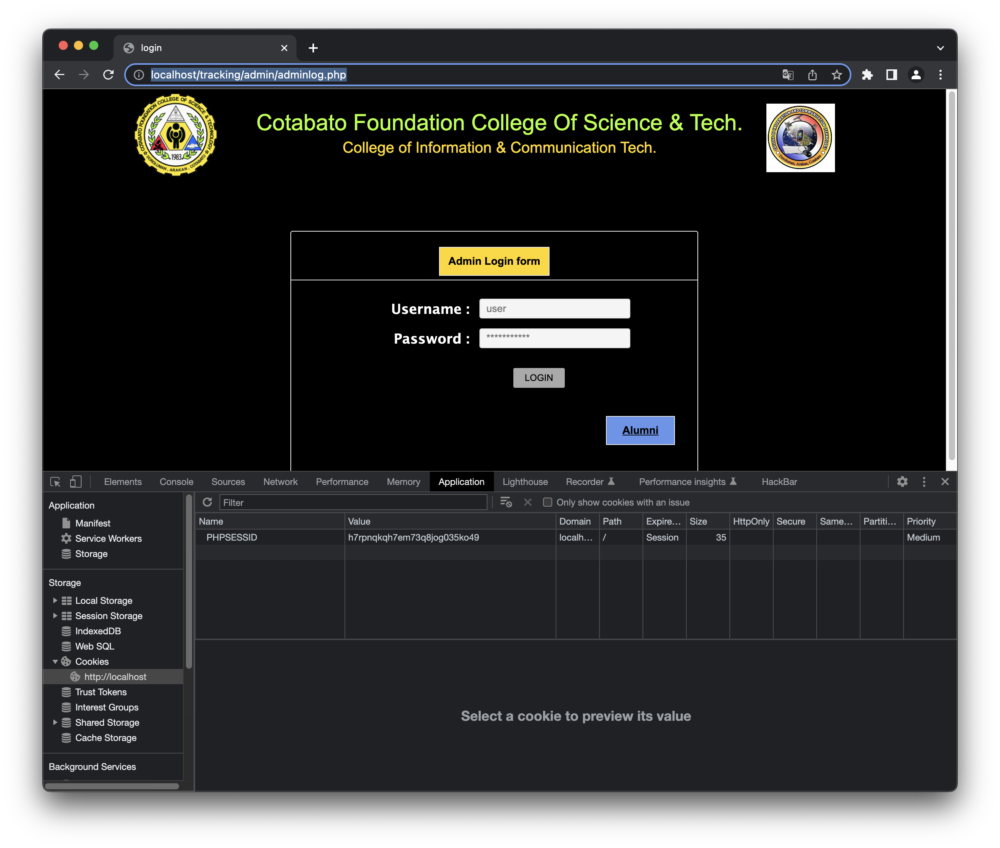
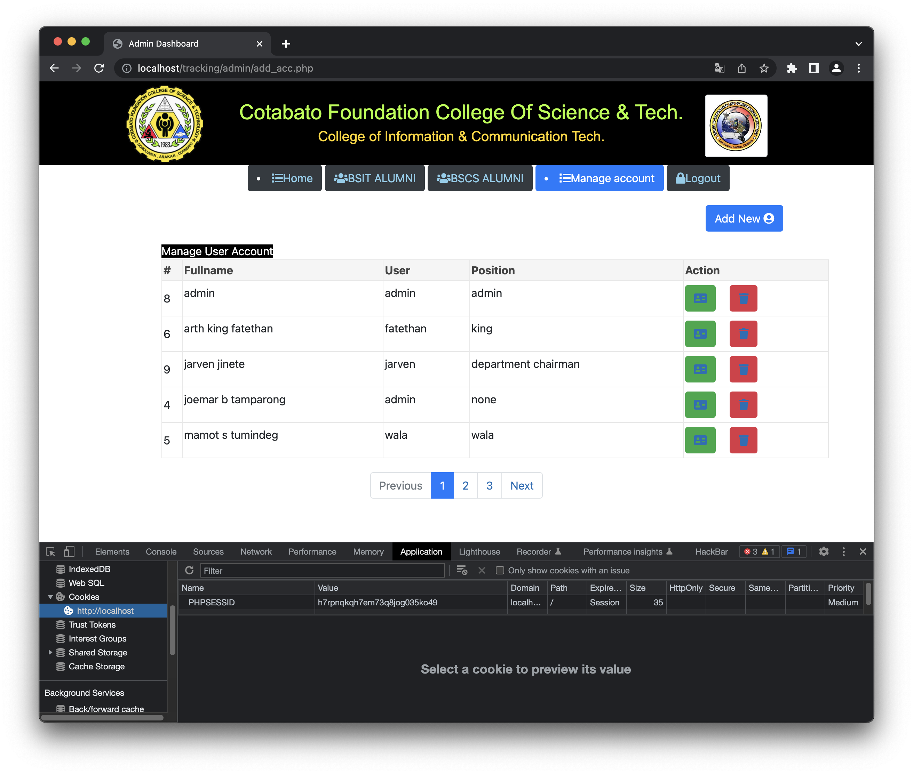
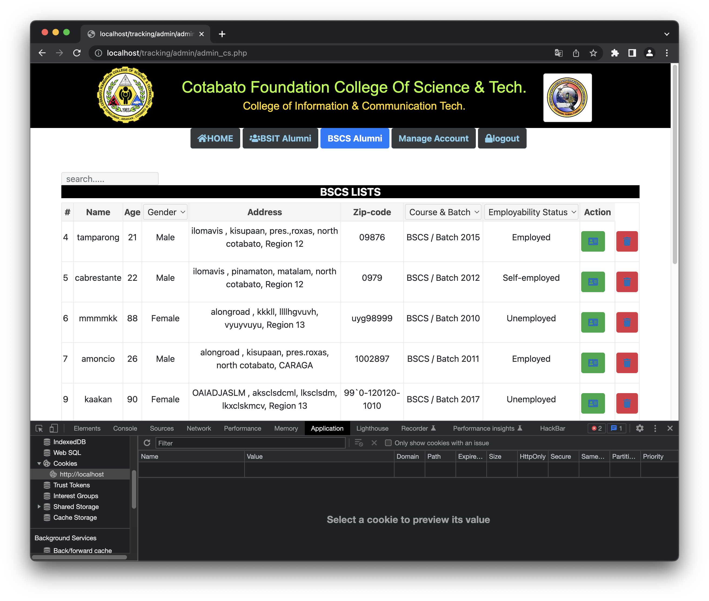

# Online Graduate Tracer System for College of ICT Alumni has unauthorized access vulnerability

First,we try to get into the admin page

http://localhost/tracking/admin/

the website lead us to http://localhost/tracking/admin/adminlog.php and require login

We try to login to access the admin function page

At that time, we delete all of the cookies and refresh page, see what if we can still use the page

obviously we can, try to turn to the other pages

it still working

Code Link

https://www.sourcecodester.com/php/15904/online-graduate-tracer-system-college-ict-alumni.html
